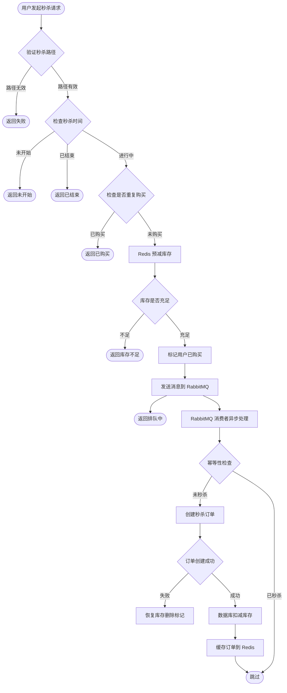
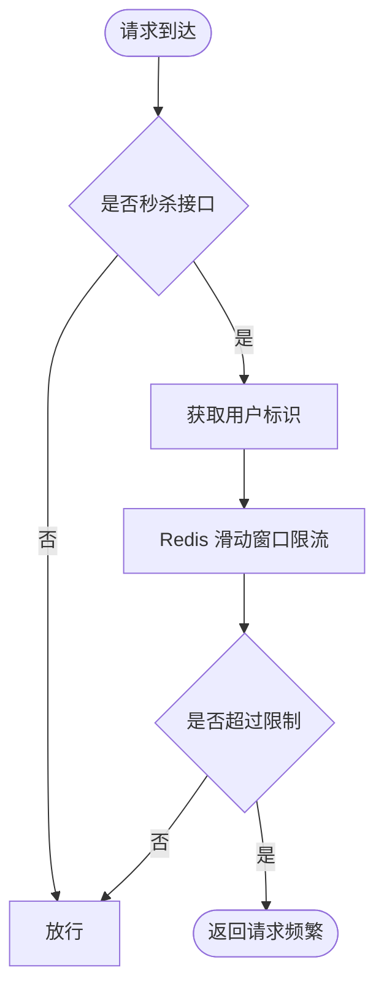
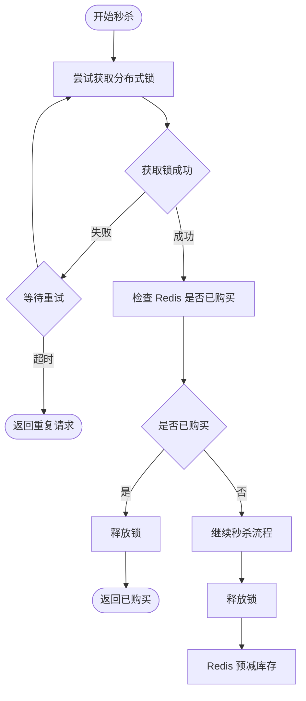
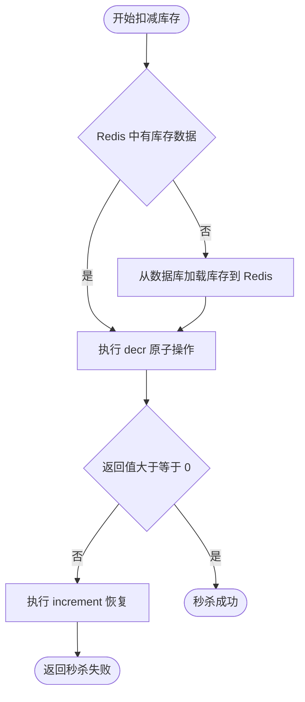
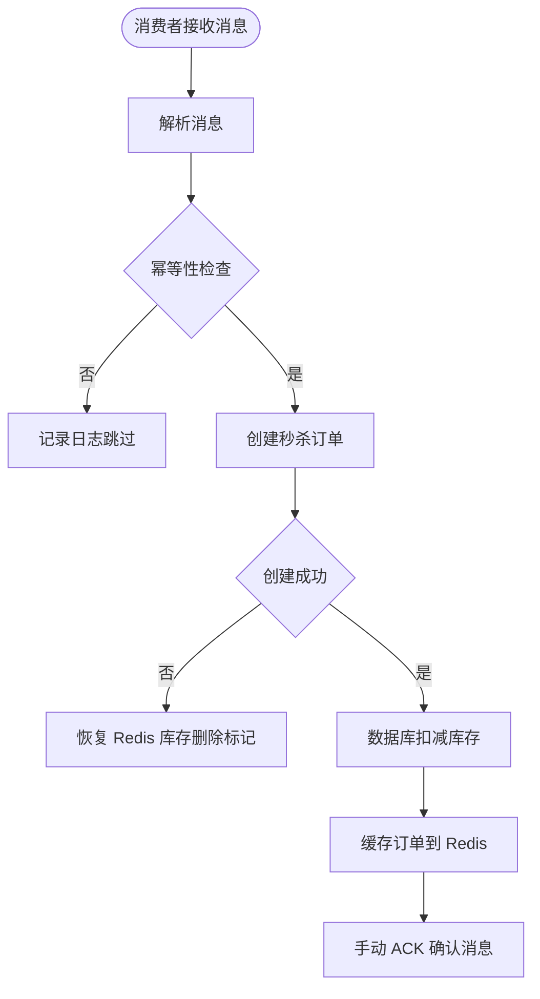
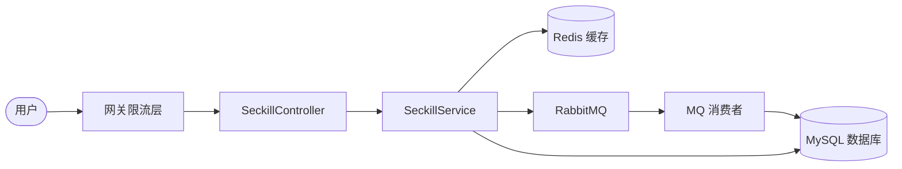
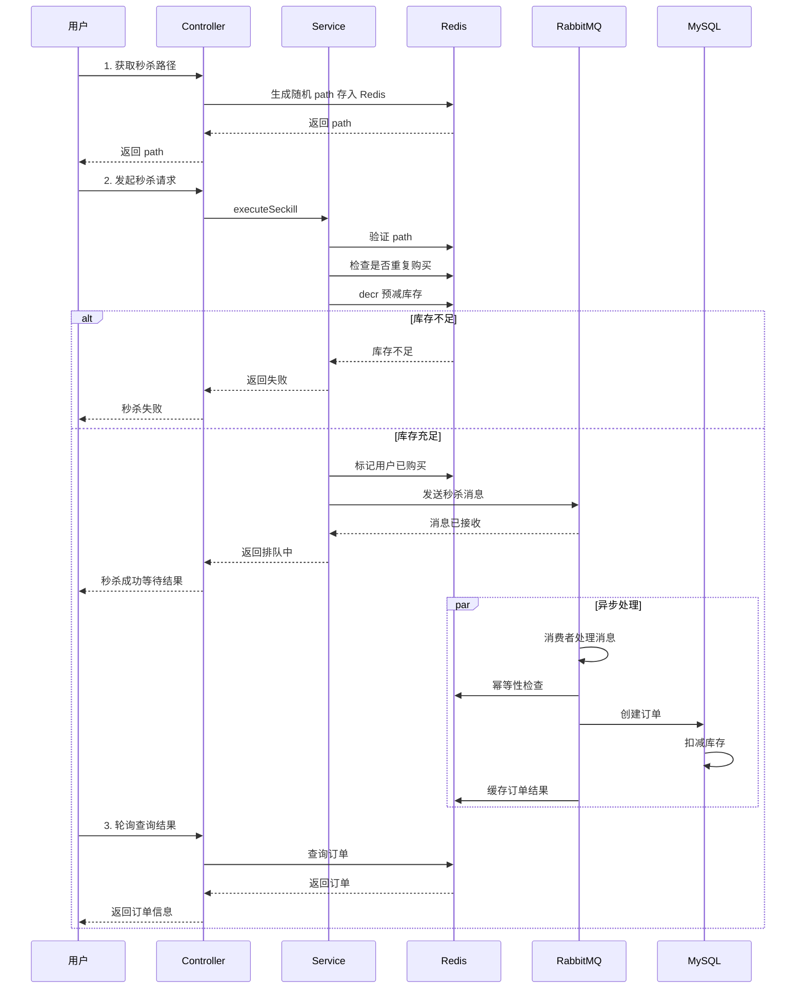

# 秒杀系统流程图

## 1. 秒杀核心流程



## 2. 限流流程



## 3. 分布式锁防重复



## 4. Redis 预减库存流程



## 5. RabbitMQ 异步下单流程



## 6. 整体架构流程



## 7. 时序图



## 8. 秒杀路径示例 - 接口返回与前端调用

### 8.1 接口返回数据格式

#### 第一步：获取秒杀路径

**前端请求：**
```http
GET /api/seckill/path?productId=1001
Header:
  X-User-Id: 12345
```

**后端返回 JSON：**
```json
{
  "code": 200,
  "message": "success",
  "data": "a1b2c3d4e5f6g7h8i9j0k1l2m3n4o5p6",
  "timestamp": 1712048400000
}
```

这个 `data` 就是一个 32 位的随机 UUID 字符串。

#### 第二步：发起秒杀

**前端请求：**
```http
POST /api/seckill/execute?productId=1001
Header:
  X-User-Id: 12345
  X-Seckill-Path: a1b2c3d4e5f6g7h8i9j0k1l2m3n4o5p6
```

**后端返回 JSON（秒杀成功，排队中）：**
```json
{
  "code": 200,
  "message": "秒杀成功，正在处理订单",
  "data": null,
  "timestamp": 1712048401000
}
```

**后端返回 JSON（秒杀失败）：**
```json
{
  "code": 500,
  "message": "库存不足",
  "data": null,
  "timestamp": 1712048401000
}
```

#### 第三步：查询秒杀结果

**前端请求：**
```http
GET /api/seckill/result?productId=1001
Header:
  X-User-Id: 12345
```

**后端返回 JSON（有订单）：**
```json
{
  "code": 200,
  "message": "success",
  "data": {
    "id": 10001,
    "orderNo": "SK1712048401000A1B2C3D4",
    "userId": 12345,
    "productId": 1001,
    "productName": "iPhone 15 Pro Max",
    "seckillPrice": 4999.00,
    "status": 0,
    "createTime": "2026-04-02 10:00:01"
  },
  "timestamp": 1712048405000
}
```

### 8.2 前端页面完整示例

```html
<!DOCTYPE html>
<html>
<head>
    <title>秒杀商品</title>
</head>
<body>
    <div id="app">
        <h1>{{ productName }}</h1>
        <p>秒杀价：￥{{ seckillPrice }}</p>
        <p>库存：{{ stock }}</p>
        <button id="seckillBtn" onclick="doSeckill()">立即秒杀</button>
        <div id="result"></div>
    </div>

    <script>
        const userId = 12345;  // 实际从登录信息获取
        const productId = 1001;
        let seckillPath = null;

        // 页面加载时，先获取秒杀路径
        async function loadSeckillPath() {
            const res = await fetch(`/api/seckill/path?productId=${productId}`, {
                headers: { 'X-User-Id': userId }
            });
            const result = await res.json();

            if (result.code === 200) {
                seckillPath = result.data;
                console.log('获取到秒杀路径:', seckillPath);
                // 此时按钮才启用
                document.getElementById('seckillBtn').disabled = false;
            }
        }

        // 点击秒杀按钮
        async function doSeckill() {
            const res = await fetch(`/api/seckill/execute?productId=${productId}`, {
                method: 'POST',
                headers: {
                    'X-User-Id': userId,
                    'X-Seckill-Path': seckillPath
                }
            });
            const result = await res.json();

            document.getElementById('result').innerHTML =
                `<p>${result.message}</p>`;

            // 开始轮询查询结果
            if (result.code === 200) {
                pollResult();
            }
        }

        // 轮询查询秒杀结果
        async function pollResult() {
            const timer = setInterval(async () => {
                const res = await fetch(`/api/seckill/result?productId=${productId}`, {
                    headers: { 'X-User-Id': userId }
                });
                const result = await res.json();

                if (result.data) {
                    clearInterval(timer);
                    document.getElementById('result').innerHTML +=
                        `<p>订单号：${result.data.orderNo}</p>
                         <p>价格：￥${result.data.seckillPrice}</p>`;
                }
            }, 1000);  // 每秒轮询一次
        }

        // 页面加载时获取 path
        loadSeckillPath();
    </script>
</body>
</html>
```

### 8.3 完整流程示意图

```
┌─────────────┐
│   用户打开   │
│  秒杀页面    │
└──────┬──────┘
       │
       ▼
┌─────────────────────────────────┐
│ 前端自动调用 /api/seckill/path  │
└──────┬──────────────────────────┘
       │
       ▼
┌─────────────────────────────────┐
│ 后端返回 path                    │
│ "a1b2c3d4e5f6g7h8..."          │
│ 前端存储起来，启用秒杀按钮       │
└──────┬──────────────────────────┘
       │
       ▼
┌─────────────┐
│  用户点击    │
│ "立即秒杀"  │
└──────┬──────┘
       │
       ▼
┌─────────────────────────────────┐
│ 前端携带 path 发起秒杀请求       │
│ Header: X-Seckill-Path: xxx    │
└──────┬──────────────────────────┘
       │
       ▼
┌─────────────────────────────────┐
│ 后端验证 path 是否正确           │
│ ✓ 正确 → 继续秒杀逻辑           │
│ ✗ 错误 → 返回"非法的秒杀路径"   │
└─────────────────────────────────┘
```

### 8.4 秒杀路径设计要点

| 要点 | 说明 |
|------|------|
| path 是**后端生成**的 | 前端无法预测，只能请求获取 |
| path 存在 Redis | 带过期时间（5 分钟），超时失效 |
| path 与用户绑定 | `userId:productId` 作为 key，不能跨用户复用 |
| 先有 path 才能秒杀 | 没有 path 的请求直接被拦截 |

这样设计，攻击者就算抓包分析了接口，每次的 path 都不一样，而且会过期，大大增加了攻击成本。
